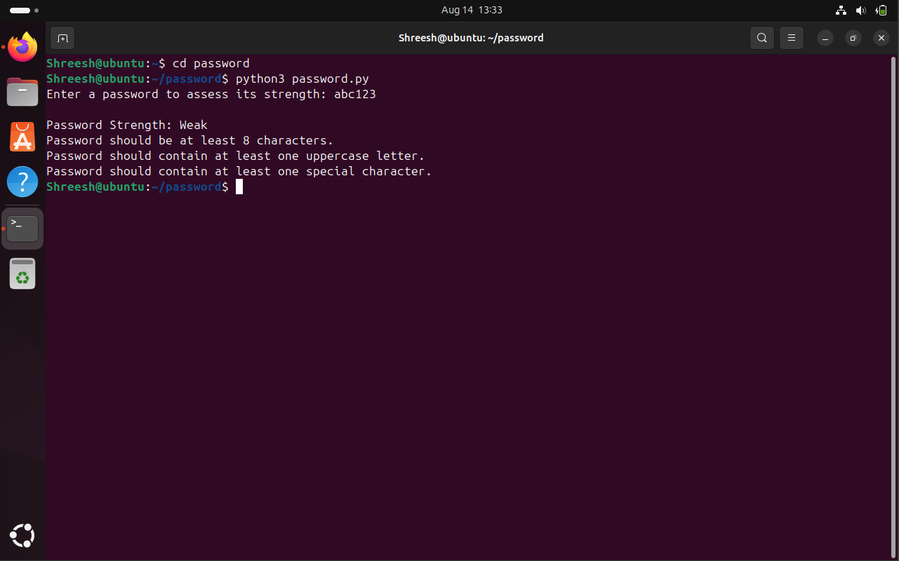
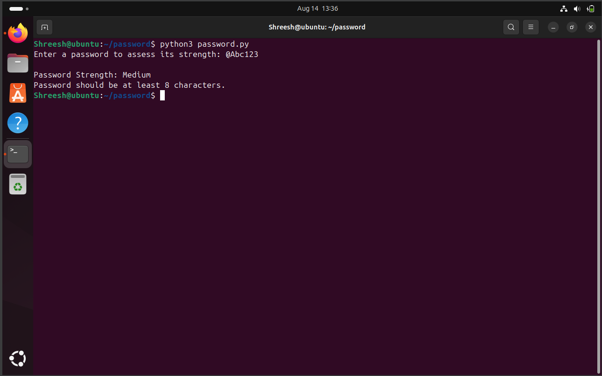
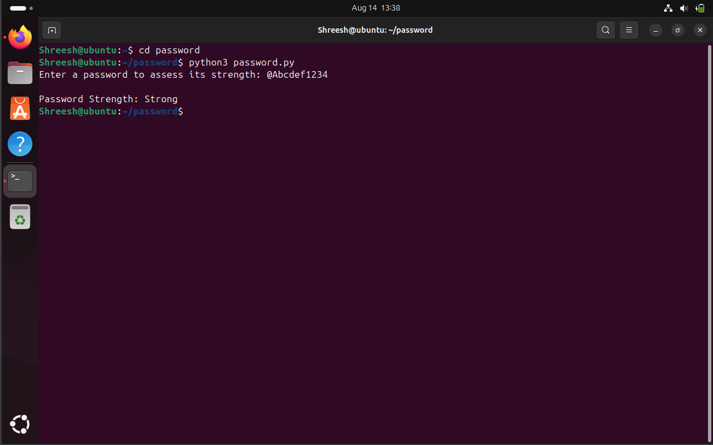

# Password Strength Checker (Python)

A Python program that evaluates the strength of a password based on multiple security criteria and provides feedback for improvement.

---

## 📂 Project Structure
```bash
📦 password-strength-checker
 ┣ 📜 password_checker.py   # Main script
 ┣ 📜 README.md             # Documentation
 ```
 ---

## 🎯 Objective

The objective of this project is to help users create secure passwords by analyzing the strength of their chosen password. It ensures that users understand the importance of password complexity in protecting accounts and systems from brute-force and dictionary attacks.

Specifically, this project aims to:

- Provide a quick assessment of whether a password is weak, medium, or strong.
- Educate users about essential password requirements.
- Offer real-time feedback to help improve weak passwords.
- Demonstrate the use of regular expressions (regex) in Python for pattern matching.

---

## 📝 Description

This tool checks a password against five security criteria:

- Minimum length of 8 characters.
- Contains at least one uppercase letter.
- Contains at least one lowercase letter.
- Contains at least one digit.
- Contains at least one special character (e.g., !@#$%^&*).

The program assigns a strength level based on how many criteria are met:
- Strong → All 5 criteria satisfied.
- Medium → 4 out of 5 criteria satisfied.
- Weak → Less than 4 criteria satisfied.

Additionally, it provides feedback messages suggesting how to improve the password.

---

## 🛠️ Technologies Used

- Python 3
- Regex (re module) for pattern matching 

---

## Images / Screenshots  

  
  
  

  

